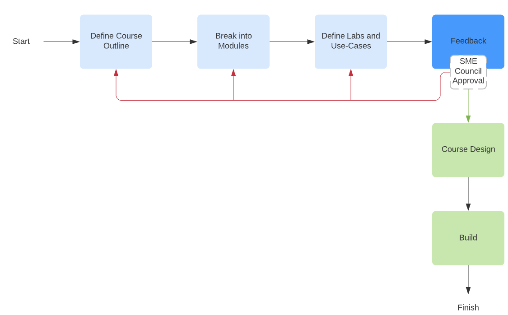

## 📔 Learning Content

This repository is to store all files related to Learning content. This is where we house, maintain, and collaborate on the Apollo learning courses. In this README file we will explain how the Learning_Content repository is orgainized and some of the standards that are in place to keep this repository clean and organized.

## ℹ️  Definitions

- **Learning Path** - a learning path is a collection of modules
- **Module** - a basic consumble unit of foundational, technical, or advance implentation/Product learning 
- **Use Case** - a scenario that demonstrates real life implementations, typically utilizes multiple skills
- **Lab** - an interactive activity and typically has hands on action about a topic to re-inforce a particular learning objectives
- **tags** - a collection of tags describing the course content, leveraged in moment of need and search of a specific topic

## 🔱 The Zen of the Learning Content Repository

1. A single source of truth for all files and media related to a learning path/module, course, etc.
2. Treating Learning Content as code, which allows Cisco to develop and maintain all learning content in an agile/lean work flow. Ensure that updates are done accurately and minimizes team confusion. That course development and maintenance is streamlined and simplified allow Cisco to quickly bring new learning paths/courses to market and update existing courses in a timely manner.
3. To create a process that is straight forward and easy to understand, which makes it easy for vendors and employees to collaborate.
4. To develop accurate and consistent learning journeys.

## 💢 Repository Structure

- `<ROOT FOLDER>` - This is the main repo name, which contains subdirectories (defined below), `Root folder` is the same name as the repo which is labeled after the learning content being created.
- `assessments` - This is where skill assessments/quizzes related to job skills or course specific skills are defined.
- `assets` - Use this subdirectory to house any assets related to content, diagrams, images .. etc
- `course-outline` This subdirectory is used to define the course outline, template included.
- `labs` - This subdirectory where `hands on labs` related to the learning content is defined. This is also treated as a standalone module when building a learning path.
- `learning-path`- This subdirectory contains work related to defining a learning path from the `modules` defined for the course.
- `modules` - This subdirectory contains the `micro learning` portions of the course content, this is derived from the course outline and expanded upon in details.
- `tags` - This is where we will define content related tags in `JSON` format, this will be leveraged when locating and searching for content in `Ti`.
- `use-cases` - This is where related, real world scenarios are defined and built, `Use Cases` are typically used within a learning path or standalone offering outside of the course content.
- `README.md` - This is the main README.md within the repo, this is where the course outline is defined and saved - see a course outline example here.
 
## 〽️  READMEs
In addition to the README you're reading right now, this repo includes other READMEs that describe the purpose of each subdirectory in more detail:

- [assessments/README.md](assessments/README.md)
- [course-outline/README.md](course-outline/README.md)
- [labs/README.md](labs/README.md)
- [learning-path/README.md](learning-path/README.md)
- [modules/README.md](modules/README.md)
- [tags/README.md](tags/reusables/README.md)
- [use-cases/README.md](use-cases/variables/README.md)

## ☑️  Content Definition Workflow 
1. [ ] Define `course outline`, using this [course outline template](/course-outline/outline-template.md)
2. [ ] Define each `module` from course outline and deep dive into module design and topics, leverage [this module template](/modules/module-template.md)
3. [ ] Define related `labs` and real world `use cases`. leverage templates provided here for each [lab](/labs/lab-template.md) or [use case](/use-cases/usecase-template.md) to help you define
4. [ ] Define your learning path using the defined modules, labs and use cases. 

```diff
+ Logically align the path(s) based on Persona and Job skill research work done in parallel to this process
```


## 💡 Resources and Tools
- [Markdown CheatSheet](https://github.com/adam-p/markdown-here/wiki/Markdown-Cheatsheet)
- [Quick Introduction to Git](https://gitimmersion.com/)

